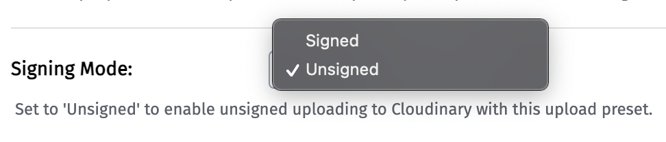
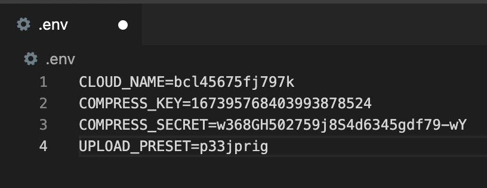

# _Prescription_

#### _A program designed for developers to quickly compresses and manipulate images or videos_  
#### By _**Brian Sturgis, Zack Rutledge & Chloe Loveall**_
<br>

 &nbsp;  &nbsp;  &nbsp;  &nbsp;  &nbsp; 

## Table of Contents

1. [Table of Contents](#table-of-contents)
2. [Demo/Preview](#demo/preview)
3. [Technologies Used](#technologies-used)
4. [Description](#description)
5. [Setup/Installation Requirements](#setup/installation-requirements)
    * [Installation](#installation)
    * [Cloudinary API Setup](#cloudinary-api-setup) 
6. [Usage](#usage)
7. [Contributing](#contributing)
8. [Known Bugs](#known-bugs)
9. [License](#license)
10. [Acknowledgements](#acknowledgements)
11. [Contact Information](#contact-information)

## Demo/Preview

## Technologies Used

* Adobe Photoshop 2021
* Bootstrap 4.5.3
* Cloudinary
* CSS
* eslint 6.3.0
* HTML
* JavaScript ES6
* Jest 24.9.0
* jQuery 3.5.1
* Node Package Manager 6.14.9
* Postman 8.0.4
* webpack 4.39.3

## Description

Prescription utilizes the Cloudinary API and it's widget functionality to allow users to upload photos/videos from their computer, a webpage, Google Drive, Dropbox, Facebook, Instagram or Shutterstock. The image can then be compressed and manipulated with the click of a button.  
<br>
Current image manipulations include: Instagram-esque filter effects, facial blurring (of one or multiple faces), and image scaling with the user's chosen dimensions. Current video manipulations include: video trimming (from beginning and/or end), slow motion effect, video scaling with the user's chosen dimensions, and the ability to convert a video to a GIF. Additionally, the user can specify the returned file type (.svg, .png, and .svg for images/.mov and .mp4 for video).

## Setup/Installation Requirements

#### Installation
* Clone the repository with the following git terminal command: ```$ git clone https://github.com/BrianSturgis/JanTeamWeek.git```
* Open the project directory in your terminal
* Confirm you have installed [Node](https://www.learnhowtoprogram.com/intermediate-javascript/getting-started-with-javascript/installing-node-js) and [Node Package Manager](https://www.learnhowtoprogram.com/intermediate-javascript/test-driven-development-and-environments-with-javascript/building-a-manifest-file-with-npm)
* Recreate the project environment/install required dependencies by running the terminal command: ```$ npm install```
* Create the production environment by running the terminal command: ```$ npm run build```
* Open the project in the browser of your choice with the terminal command: ```$ npm run start```

#### Cloudinary API Setup 
* Go to [Cloudinary](https://cloudinary.com/) to sign up for a free account. This will allow you to acquire a cloud name, API key, and API secret (can be viewed through your account dashboard)
  * In your Cloudinary account, go to: Settings -> Upload -> Upload presets -> Add upload preset
  * From the "Signing Mode" dropdown, select unsigned and then save the preset:
  

#### API Security  
* Create a ```.env``` file in the root directory of the project.***
  * Copy the cloud name, API key, API secret, and preset name from your Cloudinary account and paste into your ```.env``` file, but please note the example below does not contain real or valid information: 
  

***A ```.env``` file along with the ```dotenv-webpack``` will keep your API key secure. [Read more about API key security](https://www.learnhowtoprogram.com/intermediate-javascript/asynchrony-and-apis/managing-api-keys).

## Usage

## Contributing

Contributions are what make the open source community such an amazing place to be learn, inspire, and create. Any contributions you make are greatly appreciated.

1. Fork the project on GirHub
    * Follow [Installation/Setup Instructions](#setup/installation-requirements) above
2. Create your Feature Branch: ```$ git checkout -b YourFeatureBranchName```
3. Commit your Changes ```$ git commit -m 'Add some AmazingFeature'```
4. Push to your feature branch on Github ```$ git push origin YourFeatureBranchName```
5. Open a Pull Request

## Known Bugs

* None at this time 

## License

[MIT](LICENSE.md)

## Acknowledgements

* [Shields](https://shields.io/)
* [Choose an open source license](https://choosealicense.com/)
* [GitHub Pages](https://pages.github.com/)

## Contact Information 

_Brian Sturgis <sturujisu@gmail.com>_<br>
_Zack Rutledge <thorgrim88@gmail.com>_<br>
_Chloe Loveall <chloeloveall@protonmail.com>_<br>

 &nbsp;  &nbsp; 